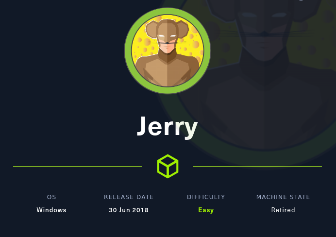

# Hack The Box
    
  

  
  
## Máquina Jerry

  

### Solución
    
    USER FLAG: 
               user.txt 7004dbcef0f854e0fb401875f26ebd00
    
    ROOT FLAG: 
               root.txt 04a8b36e1545a455393d067e772fe90e
    
   

### Escaneo nmap

### Usamos whatweb modo lammer

### Abrimos la página

### Intentamos entrar en manager app

Nos pide credenciales las cuales vienen por defecto en el mensaje de error que nos sale.

### Probamos Credenciales por defecto

### Sacando credenciales por defecto 2

Existen dos maneras de sacar las credenciales por defecto en este caso. 1 con un payload en msfdb y otra con hydra.

#### msfdb

#### hydra

### Investigando la página

Vemos que tiene una función la cual nos permite subir archivos .war que nos permitirá tener una reverse shell de varias formas.

Probamos también a ver si es vulnerable al CVE-2017-12617 sin éxito

### Reverse shell

Con msfdb y el exploit/multi/http/tomcat_mgr_upload podemos conseguir una shell en el sistema una vez tengamos credenciales validas.

### Capturando la flag

Navegando entre directorios encontramos en el /home/Users/Administrator/Desktop/flags un archivo llamado 2 for the price of 1.txt.

### Pwned!

**Autor:** [AlbertoMiñan](https://github.com/albertominan)
